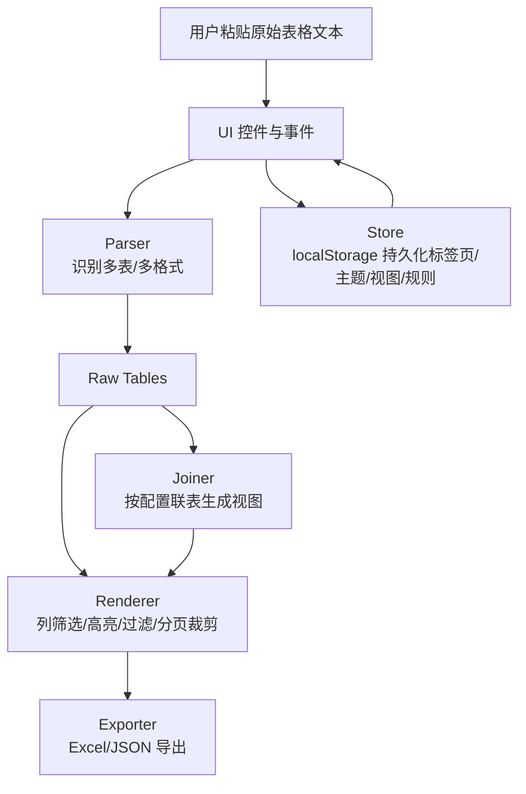

# 离线表格解析工具 v16.4（Smart Parser）

一个纯前端、可离线运行的表格解析与查看器。支持将文本形式的表格快速转成可过滤/高亮/联表的多标签页预览，并导出 Excel 或配置备份，无需依赖后端或安装。

## 架构示意

## 功能点
- 离线运行：单个 `index.html` 打开即可，解析和导出全在浏览器本地完成。
- 多标签页：可并行保存多份数据源与配置，状态持久化到 localStorage。
- 多格式解析：自动识别 `table-data <name>` 段落中的空格/Tab/CSV/定宽表头，兼容示例格式。
- 视图联表：通过可视化 Join 配置器管理全局视图，支持 inner/left join、字段映射与列选择。
- 高亮与过滤：全局过滤、表级过滤、高亮规则（支持 `= != > >= < <= :` 及 `|` OR 语法），可仅显示高亮行。
- 列关注：为目标表配置显示列或聚焦列，辅助快速比对。
- 导出与备份：可导出原始表/预览表为 Excel，或导入导出标签页与配置 JSON。
- 主题与交互：浅/深色主题切换，表格拖选 + `Ctrl+C` 复制为 TSV/HTML。

## 使用说明
1) 打开：直接双击 `index.html` 或用浏览器打开（无需服务器环境）。  
2) 粘贴数据：将文本粘贴到左侧“数据源”，点击“解析并渲染”。可用“示例”按钮快速加载示例数据。  
3) 数据段格式：  
   - 以 `table-data <表名>` 开始，下一行应是以 `validflag` 开头的表头行。  
   - 表头行可为空格分隔、制表符分隔、CSV，或定宽（自动推断列范围）。  
   - 数据行按表头列数解析，遇到空行或以 `<`/`[` 开头行时结束当前表。  
4) 过滤与高亮：  
   - 全局过滤：`key=val`、`key!=val`、`key>90`、`msg:error`、`/regex/`，用空格分隔表示 AND。  
   - 表级规则：在“规则配置”中选择目标表，设置高亮规则和行过滤；勾选“仅显示高亮行”可只看匹配行。  
5) 列关注：选择目标表后，点击“选择”选择需要展示/关注的列。  
6) 视图联表：  
   - 在“管理”进入全局视图列表，新增/编辑视图，填写左表、右表、Join 类型、`ON` 关系（如 `ID=ProdID`），勾选需要输出的列（左/右前缀自动处理）。  
   - 保存后在“启用 JOIN 视图”中勾选视图即可渲染。  
7) 导出/备份：  
   - “导出原始”/“导出预览”导出 Excel；“导出页签”导出所有标签页 JSON；“导入页签”恢复。  
   - “导出配置”/“导入配置”仅同步配置与视图（不覆盖原始数据）。  
8) 其他：顶部标签可新增/关闭；右上角图标切换主题；表格拖拽选区后 `Ctrl+C` 可复制所选区域。

## 操作提示
- 若只想显示部分原始表，在“显示原始表”里勾选；未勾选时默认全显示。
- 预览最多显示 500 行，超出部分会提示剩余行数，不影响导出。
- 视图可引用视图（递归联表），但会自动阻止循环依赖。
- 清除浏览器缓存会丢失本地保存的标签页/配置，请先导出 JSON 备份。

## 目录
- `index.html`：全部逻辑与样式，直接运行即可。
